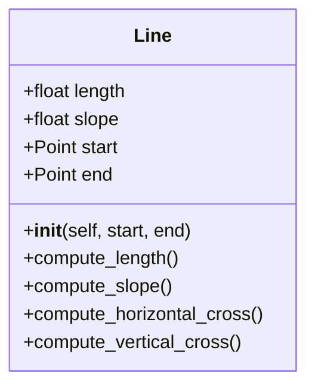
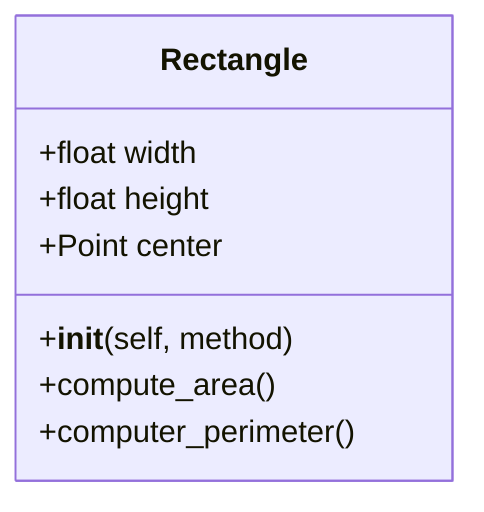

# Reto 3

**Ejercicio:**

1. Create class Line.

- length, slope, start, end: Instance attributes, two of them being points (so a line is composed at least of two points).
- compute_length(): should return the line´s length
- compute_slope(): should return the slope of the line from tje horizontal in deg.
- compute_horizontal_cross(): should return if exists the intersection with x-axis
- compute_vertical_cross(): should return if exists the intersection with y-axis
- Redefine the class Rectangle, adding a new method of initialization using 4 Lines (composition at its best, a rectangle is compose of 4 lines).

Optional: Define a method called discretize_line() that creates an array on n equally spaced points in the line and assigned as a instance attribute.

# Reto 3
1. Create a repo with the class exercise
2. Restaurant scenario: You want to design a program to calculate the bill for a customer's order in a restaurant.
3. Define a base class MenuItem: This class should have attributes like name, price, and a method to calculate the total price.
4. Create subclasses for different types of menu items: Inherit from MenuItem and define properties specific to each type (e.g., Beverage, Appetizer, MainCourse).
5. Define an Order class: This class should have a list of MenuItem objects and methods to add items, calculate the total bill amount, and potentially apply specific discounts based on the order composition.
6. Create a class diagram with all classes and their relationships. The menu should have at least 10 items. The code should follow PEP8 rules.

   
**For this challenge, use the previous exercise.**

**Ejercicio:**
1. Cree la clase Rectangle.

 - The rectangle should be inicialice using any of these 3 methods:
    + Method 1: Bottom-left corner(Point) + width and height
    + Method 2: Center(Point) + width and height
    + Method 3: Two opposite corners (Points) e.g. Bottom-left and Upper-right

 - *width*, *height*, center: Instance attributes
 - compute_area(): should return the area of the rectangle
 - compute_perimeter(): should return the perimeter of the rectangle

2. Create a class Square() that inherited the required attributes and methods from Rectangle.

3. Create a method called compute_interference_point(Point) that returns if a point is inside or a rectangle.

4. **Optional:** Define a method called compute_interference_line() that return if a line or part of it is inside of a rectangle.

